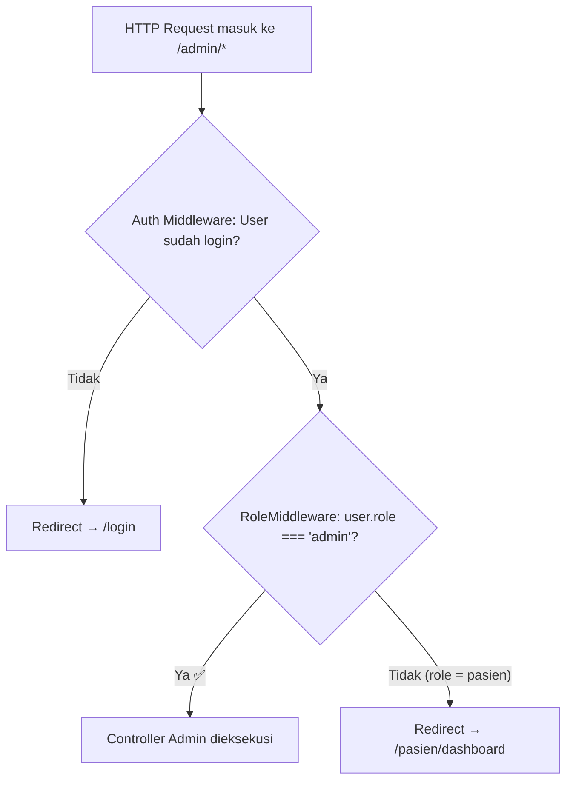
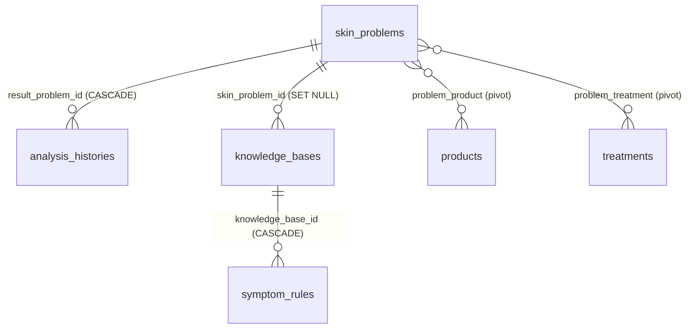
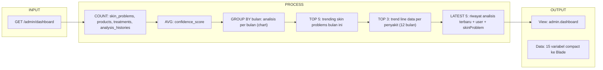
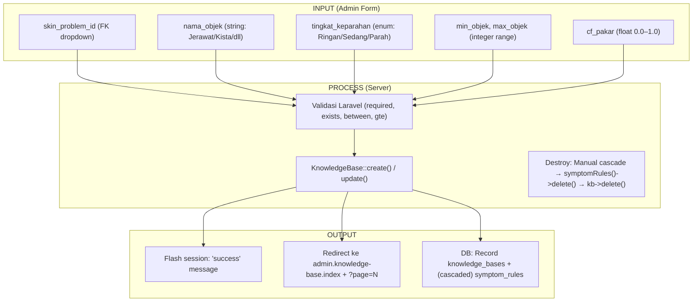
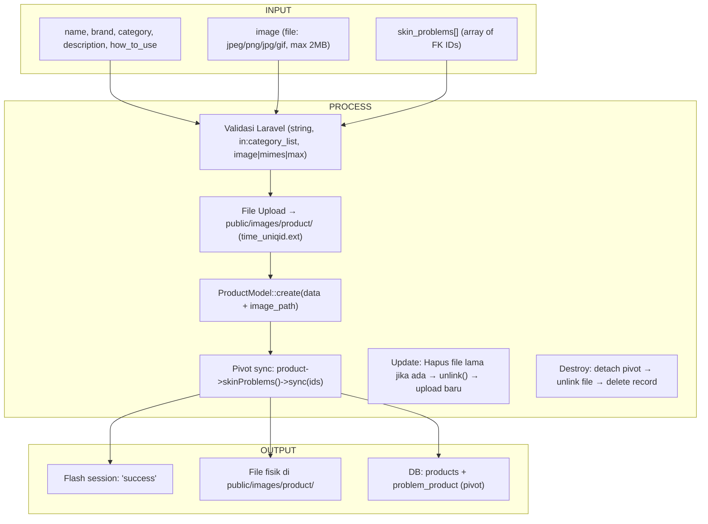
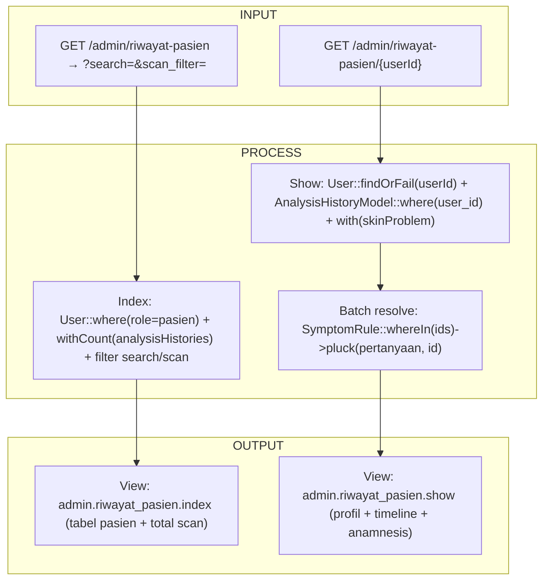

# 📋 Laporan Audit Admin Panel — Kode, Arsitektur & Keamanan
## The Ethereal Clinic — Laravel Backend Administration
**Tanggal Audit:** 18 Juni 2026  
**Auditor:** Antigravity AI (Senior Systems Analyst, DBA & IT Auditor)  
**Cakupan Audit:** Seluruh endpoint, controller, model, middleware, dan migrasi yang berkaitan dengan fitur Admin Panel.

---

### Inventaris File yang Diaudit

| # | File | Peran |
|---|---|---|
| 1 | [Dashboard_ADMController.php](file:///c:/laragon/www/ethereal-clinic/app/Http/Controllers/Dashboard_ADMController.php) | Dashboard statistik admin |
| 2 | [SkinProblemController.php](file:///c:/laragon/www/ethereal-clinic/app/Http/Controllers/SkinProblemController.php) | CRUD Masalah Kulit |
| 3 | [dataGejalaController.php](file:///c:/laragon/www/ethereal-clinic/app/Http/Controllers/dataGejalaController.php) | CRUD Knowledge Base (Basis Pengetahuan Pakar) |
| 4 | [SymptomRuleController.php](file:///c:/laragon/www/ethereal-clinic/app/Http/Controllers/SymptomRuleController.php) | CRUD Pertanyaan Anamnesis |
| 5 | [DataProduct_ADMController.php](file:///c:/laragon/www/ethereal-clinic/app/Http/Controllers/DataProduct_ADMController.php) | CRUD Data Produk |
| 6 | [DataTreatment_ADMController.php](file:///c:/laragon/www/ethereal-clinic/app/Http/Controllers/DataTreatment_ADMController.php) | CRUD Data Treatment |
| 7 | [RiwayatPasien_ADMController.php](file:///c:/laragon/www/ethereal-clinic/app/Http/Controllers/RiwayatPasien_ADMController.php) | Manajemen Riwayat Pasien |
| 8 | [Profile_ADMController.php](file:///c:/laragon/www/ethereal-clinic/app/Http/Controllers/Profile_ADMController.php) | Profil & Keamanan Akun Admin |
| 9 | [AdminNewsController.php](file:///c:/laragon/www/ethereal-clinic/app/Http/Controllers/AdminNewsController.php) | CRUD Berita & Artikel |
| 10 | [RoleMiddleware.php](file:///c:/laragon/www/ethereal-clinic/app/Http/Middleware/RoleMiddleware.php) | Gerbang otorisasi RBAC |
| 11 | [AuthController.php](file:///c:/laragon/www/ethereal-clinic/app/Http/Controllers/AuthController.php) | Login, Register, Logout |
| 12 | [web.php](file:///c:/laragon/www/ethereal-clinic/routes/web.php) | Definisi rute & middleware |
| 13 | [User.php](file:///c:/laragon/www/ethereal-clinic/app/Models/User.php) | Model User + role |
| 14 | Model: [KnowledgeBase](file:///c:/laragon/www/ethereal-clinic/app/Models/KnowledgeBase.php), [SymptomRule](file:///c:/laragon/www/ethereal-clinic/app/Models/SymptomRule.php), [SkinProblemModel](file:///c:/laragon/www/ethereal-clinic/app/Models/SkinProblemModel.php), [ProductModel](file:///c:/laragon/www/ethereal-clinic/app/Models/ProductModel.php), [TreatmentModel](file:///c:/laragon/www/ethereal-clinic/app/Models/TreatmentModel.php), [News](file:///c:/laragon/www/ethereal-clinic/app/Models/News.php) | Eloquent Models |

---

## 1. AUDIT MANAJEMEN DATA & ATURAN PAKAR (CRUD)

### 1.1 Matriks Validasi CRUD per Modul

| Modul | Controller | Validasi `cf_pakar` | Validasi Rentang | Validasi FK | Validasi File |
|---|---|---|---|---|---|
| **Knowledge Base** | [dataGejalaController](file:///c:/laragon/www/ethereal-clinic/app/Http/Controllers/dataGejalaController.php#L46-L88) | ✅ `between:0,1` | ✅ `gte:min_objek` | ✅ `exists:skin_problems,id` | N/A |
| **Symptom Rules** | [SymptomRuleController](file:///c:/laragon/www/ethereal-clinic/app/Http/Controllers/SymptomRuleController.php#L73-L95) | ✅ `min:0.1, max:1.0` | N/A | ✅ `exists:knowledge_bases,id` | N/A |
| **Skin Problems** | [SkinProblemController](file:///c:/laragon/www/ethereal-clinic/app/Http/Controllers/SkinProblemController.php#L36-L55) | N/A | N/A | N/A | N/A |
| **Products** | [DataProduct_ADMController](file:///c:/laragon/www/ethereal-clinic/app/Http/Controllers/DataProduct_ADMController.php#L31-L73) | N/A | N/A | ✅ `exists:skin_problems,id` | ✅ `image\|mimes\|max:2048` |
| **Treatments** | [DataTreatment_ADMController](file:///c:/laragon/www/ethereal-clinic/app/Http/Controllers/DataTreatment_ADMController.php#L29-L49) | N/A | N/A | ✅ `exists:skin_problems,id` | N/A |
| **News** | [AdminNewsController](file:///c:/laragon/www/ethereal-clinic/app/Http/Controllers/AdminNewsController.php#L41-L72) | N/A | N/A | N/A | ✅ `image\|mimes\|max:2048` |

### 1.2 Analisis Validasi CF Pakar

#### Knowledge Base (`cf_pakar` Visual)
**Lokasi:** [dataGejalaController, L55](file:///c:/laragon/www/ethereal-clinic/app/Http/Controllers/dataGejalaController.php#L55)
```php
'cf_pakar' => 'required|numeric|between:0,1',
```
✅ **LULUS** — Validasi menerima rentang [0.0, 1.0] secara inklusif. Cukup ketat.

#### Symptom Rules (`cf_pakar` Gejala)
**Lokasi:** [SymptomRuleController, L78](file:///c:/laragon/www/ethereal-clinic/app/Http/Controllers/SymptomRuleController.php#L78)
```php
'cf_pakar' => ['required', 'numeric', 'min:0.1', 'max:1.0'],
```
✅ **LULUS** — Validasi membatasi minimum ke 0.1 (tidak menerima 0.0), yang secara bisnis masuk akal karena CF gejala 0.0 tidak memiliki kontribusi.

> [!NOTE]
> **Perbedaan Kebijakan:** Knowledge Base mengizinkan `cf_pakar = 0` (mematikan rule secara efektif), sementara Symptom Rules memaksa minimum 0.1. Ini bisa jadi disengaja, tetapi perlu didokumentasikan agar admin tidak bingung.

### 1.3 Analisis Pencegahan Tumpang Tindih Rentang Objek (Overlap Detection)

**Lokasi:** [dataGejalaController store()](file:///c:/laragon/www/ethereal-clinic/app/Http/Controllers/dataGejalaController.php#L46-L88) dan [update()](file:///c:/laragon/www/ethereal-clinic/app/Http/Controllers/dataGejalaController.php#L94-L138)

> [!CAUTION]
> **TIDAK ADA validasi overlap.** Sistem hanya memvalidasi bahwa `max_objek >= min_objek`, tetapi **tidak memeriksa** apakah rentang baru bertabrakan dengan rentang existing untuk `nama_objek` yang sama.
>
> **Contoh Skenario Berbahaya:**
> | ID | nama_objek | min_objek | max_objek | cf_pakar |
> |---|---|---|---|---|
> | 1 | Jerawat | 1 | 5 | 0.4 |
> | 2 | Jerawat | 3 | 10 | 0.7 |
>
> Rentang [1–5] dan [3–10] overlap di [3–5]. Ketika AI mendeteksi 4 jerawat, `KnowledgeBase::findRule('Jerawat', 4)` akan mengembalikan **record pertama yang ditemukan** (non-deterministik), menyebabkan CF visual yang tidak konsisten.

**Saran Perbaikan — Custom Validation Rule:**
```php
// Di dalam store() dan update()
$request->validate([
    // ...existing rules...
], [
    // ...existing messages...
]);

// Overlap check (setelah validasi dasar lolos)
$overlap = KnowledgeBase::where('nama_objek', $request->nama_objek)
    ->where('id', '!=', $id ?? 0) // Exclude self saat update
    ->where('min_objek', '<=', $request->max_objek)
    ->where(function ($q) use ($request) {
        $q->whereNull('max_objek')
          ->orWhere('max_objek', '>=', $request->min_objek);
    })
    ->exists();

if ($overlap) {
    return back()->withInput()->withErrors([
        'min_objek' => 'Rentang objek ini tumpang tindih dengan aturan lain untuk objek yang sama.',
    ]);
}
```

### 1.4 Analisis Penghapusan Data (Cascade Safety)

| Modul | Metode Delete | Cascade Strategy | Aman? |
|---|---|---|---|
| **Knowledge Base** | [destroy() L144-156](file:///c:/laragon/www/ethereal-clinic/app/Http/Controllers/dataGejalaController.php#L144-L156) | Manual: `$kb->symptomRules()->delete()` lalu `$kb->delete()` | ✅ Aman — child dihapus eksplisit sebelum parent |
| **Skin Problems** | [destroy() L78-86](file:///c:/laragon/www/ethereal-clinic/app/Http/Controllers/SkinProblemController.php#L78-L86) | **Langsung `$problem->delete()`** tanpa cek relasi | ⚠️ **Lihat BUG-01** |
| **Products** | [destroy() L121-141](file:///c:/laragon/www/ethereal-clinic/app/Http/Controllers/DataProduct_ADMController.php#L121-L141) | Manual: `$product->skinProblems()->detach()` + hapus file fisik | ✅ Aman |
| **Treatments** | [destroy() L75-86](file:///c:/laragon/www/ethereal-clinic/app/Http/Controllers/DataTreatment_ADMController.php#L75-L86) | Manual: `$treatment->skinProblems()->detach()` | ✅ Aman |
| **Symptom Rules** | [destroy() L149-157](file:///c:/laragon/www/ethereal-clinic/app/Http/Controllers/SymptomRuleController.php#L149-L157) | Langsung `$symptomRule->delete()` — leaf node, tidak punya child | ✅ Aman |
| **News** | [destroy() L126-137](file:///c:/laragon/www/ethereal-clinic/app/Http/Controllers/AdminNewsController.php#L126-L137) | Hapus file gambar fisik + `$news->delete()` — leaf node | ✅ Aman |

---

## 2. AUDIT KEAMANAN, OTENTIKASI & OTORISASI (RBAC LAYER)

### 2.1 Arsitektur Middleware RBAC



**Lokasi Middleware:** [RoleMiddleware.php](file:///c:/laragon/www/ethereal-clinic/app/Http/Middleware/RoleMiddleware.php)
**Registrasi Kernel:** [Kernel.php L67](file:///c:/laragon/www/ethereal-clinic/app/Http/Kernel.php) — alias `'role'`
**Penerapan Route:** [web.php L81](file:///c:/laragon/www/ethereal-clinic/routes/web.php#L81) — `Route::middleware(['auth', 'role:admin'])`

### 2.2 Hasil Peninjauan Keamanan

#### A. Proteksi Privilege Escalation
✅ **LULUS** — Seluruh rute admin berada di dalam satu route group yang di-wrap oleh middleware ganda `['auth', 'role:admin']`. Tidak ada rute admin yang terekspos tanpa middleware.

Verifikasi rute yang dilindungi:
```php
// web.php L81 — Semua rute admin di bawah satu payung
Route::middleware(['auth', 'role:admin'])->prefix('admin')->name('admin.')->group(function () {
    // 7 resource routes + 2 riwayat routes + profil routes
});
```

#### B. Proteksi CSRF
✅ **LULUS** — Laravel secara otomatis memproteksi semua request POST/PUT/DELETE melalui `VerifyCsrfToken` middleware (global middleware group). Tidak ada rute admin yang mengecualikan CSRF.

#### C. Proteksi IDOR (Insecure Direct Object Reference)

> [!WARNING]
> **CELAH TERDETEKSI** pada modul Riwayat Pasien. Detail di [BUG-03](#bug-03).

#### D. Proteksi SQL Injection
✅ **LULUS** — Semua query menggunakan Eloquent ORM atau parameter binding Laravel. Pencarian `LIKE` menggunakan `$request->search` tanpa raw query — aman karena Eloquent otomatis melakukan parameter binding.

#### E. Password Policy
| Aspek | Admin Login | Register Pasien | Admin Ubah Password |
|---|---|---|---|
| Min. Karakter | Tidak ada minimum | 8 karakter (✅) | 6 karakter (⚠️ lemah) |
| Throttling | ✅ `throttle:5,1` | ❌ Tidak ada | ❌ Tidak ada |
| Konfirmasi | N/A | ✅ `confirmed` | ✅ `same:new_password` |
| Cek Password Lama | N/A | N/A | ✅ `Hash::check()` |

### 2.3 Relational Integrity (Dampak Penghapusan terhadap Rekam Medis)



> [!CAUTION]
> **Rantai Penghapusan Paling Berbahaya:**
> Jika admin menghapus record `skin_problems` → FK `result_problem_id` di `analysis_histories` menggunakan `onDelete('cascade')` → **Seluruh riwayat diagnosis pasien yang merujuk ke penyakit tersebut akan IKUT TERHAPUS secara permanen tanpa konfirmasi.** Detail lengkap di [BUG-01](#bug-01).

---

## 3. MODEL INPUT, PROSES, OUTPUT (IPO) WORKFLOW ADMIN

### 3.1 IPO — Dashboard Admin



**Jumlah Query yang Dieksekusi:**

| # | Query | Sumber |
|---|---|---|
| 1 | `SkinProblemModel::count()` | [L22](file:///c:/laragon/www/ethereal-clinic/app/Http/Controllers/Dashboard_ADMController.php#L22) |
| 2 | `ProductModel::count()` | [L25](file:///c:/laragon/www/ethereal-clinic/app/Http/Controllers/Dashboard_ADMController.php#L25) |
| 3 | `TreatmentModel::count()` | [L28](file:///c:/laragon/www/ethereal-clinic/app/Http/Controllers/Dashboard_ADMController.php#L28) |
| 4 | `AnalysisHistoryModel::count()` | [L31](file:///c:/laragon/www/ethereal-clinic/app/Http/Controllers/Dashboard_ADMController.php#L31) |
| 5 | `User::where('role','pasien')::count()` | [L34](file:///c:/laragon/www/ethereal-clinic/app/Http/Controllers/Dashboard_ADMController.php#L34) |
| 6 | `AnalysisHistoryModel::avg(...)` | [L37](file:///c:/laragon/www/ethereal-clinic/app/Http/Controllers/Dashboard_ADMController.php#L37) |
| 7 | Analisis bulan ini (COUNT) | [L40-42](file:///c:/laragon/www/ethereal-clinic/app/Http/Controllers/Dashboard_ADMController.php#L40-L42) |
| 8 | Analisis bulan lalu (COUNT) | [L46-48](file:///c:/laragon/www/ethereal-clinic/app/Http/Controllers/Dashboard_ADMController.php#L46-L48) |
| 9 | Analisis per bulan (GROUP BY) | [L56-64](file:///c:/laragon/www/ethereal-clinic/app/Http/Controllers/Dashboard_ADMController.php#L56-L64) |
| 10 | Trending skin problems (GROUP BY + with) | [L80-87](file:///c:/laragon/www/ethereal-clinic/app/Http/Controllers/Dashboard_ADMController.php#L80-L87) |
| 11 | Fallback trending (jika kosong) | [L91-97](file:///c:/laragon/www/ethereal-clinic/app/Http/Controllers/Dashboard_ADMController.php#L91-L97) |
| 12 | Top 3 withCount | [L104-107](file:///c:/laragon/www/ethereal-clinic/app/Http/Controllers/Dashboard_ADMController.php#L104-L107) |
| 13-15 | 3× query per-bulan dalam loop | [L113-123](file:///c:/laragon/www/ethereal-clinic/app/Http/Controllers/Dashboard_ADMController.php#L113-L123) |
| 16 | Recent analysis with eager load | [L139-142](file:///c:/laragon/www/ethereal-clinic/app/Http/Controllers/Dashboard_ADMController.php#L139-L142) |

**Total: ~13–16 query per page load.** Lihat [BUG-06](#bug-06) untuk optimasi.

---

### 3.2 IPO — CRUD Knowledge Base



### 3.3 IPO — CRUD Products (dengan File Upload)



### 3.4 IPO — Manajemen Riwayat Pasien (Read-Only)



> [!TIP]
> Controller [RiwayatPasien_ADMController](file:///c:/laragon/www/ethereal-clinic/app/Http/Controllers/RiwayatPasien_ADMController.php) adalah controller yang **paling bersih** secara arsitektur: menggunakan eager loading, batch query untuk SymptomRule, dan pagination yang tepat.

---

## 4. DETEKSI BUG, REFACTORING POTENTIAL & VULNERABILITAS

### 4.1 Temuan Kritis (High Severity)

<a id="bug-01"></a>
#### 🔴 ADM-01: Penghapusan SkinProblem Memicu Cascade Delete pada Seluruh Riwayat Pasien

**Lokasi:** [SkinProblemController@destroy, L78-86](file:///c:/laragon/www/ethereal-clinic/app/Http/Controllers/SkinProblemController.php#L78-L86)

```php
public function destroy(Request $request, $id)
{
    $problem = SkinProblemModel::findOrFail($id);
    $problem->delete(); // ← BAHAYA: FK CASCADE di analysis_histories!
}
```

**Masalah:** Tabel `analysis_histories` memiliki FK `result_problem_id` dengan `onDelete('cascade')`. Ketika admin menghapus satu record `skin_problems`, **seluruh riwayat diagnosis pasien** yang merujuk ke penyakit tersebut akan **ikut terhapus secara permanen** — termasuk data CF, temuan klinis, dan jawaban anamnesis.

**Dampak:** Kehilangan data rekam medis pasien secara irreversible. Pelanggaran integritas data klinis.

**Saran Perbaikan:**
```php
public function destroy(Request $request, $id)
{
    $problem = SkinProblemModel::findOrFail($id);
    
    // Guard: Cegah penghapusan jika masih ada riwayat yang merujuk
    if ($problem->analysisHistories()->exists()) {
        return back()->withErrors([
            'error' => 'Tidak dapat menghapus: masih ada ' 
                     . $problem->analysisHistories()->count() 
                     . ' riwayat pasien yang merujuk ke penyakit ini.'
        ]);
    }
    
    // Aman untuk dihapus
    $problem->products()->detach();
    $problem->treatments()->detach();
    $problem->delete();
    
    return redirect()->route('admin.skin-problems.index')
        ->with('success', 'Data masalah kulit berhasil dihapus!');
}
```

---

<a id="bug-02"></a>
#### 🔴 ADM-02: File Upload Produk Disimpan di `public/` (Path Traversal Risk)

**Lokasi:** [DataProduct_ADMController@store, L47-56](file:///c:/laragon/www/ethereal-clinic/app/Http/Controllers/DataProduct_ADMController.php#L47-L56)

```php
$image->move(public_path('images/product'), $imageName);
```

**Masalah:**
1. File diunggah langsung ke `public/images/product/` menggunakan `move()` bukan Laravel `Storage` facade — ini melewati disk abstraction layer.
2. Nama file menggunakan `$image->getClientOriginalExtension()` yang berasal dari input klien. Meskipun ada validasi `mimes:jpeg,png,jpg,gif`, validasi `mimes` hanya memeriksa ekstensi (bukan content/magic bytes), sehingga file berbahaya bisa lolos jika diberi ekstensi `.jpg`.
3. Pola yang sama terjadi di [Profile_ADMController@updateAvatar, L97-99](file:///c:/laragon/www/ethereal-clinic/app/Http/Controllers/Profile_ADMController.php#L97-L99) dan [AdminNewsController@store, L56-59](file:///c:/laragon/www/ethereal-clinic/app/Http/Controllers/AdminNewsController.php#L56-L59).

**Saran Perbaikan:**
```php
// Gunakan Storage facade + hash name untuk keamanan
$path = $request->file('image')->store('images/product', 'public');
$productData['image_path'] = $path;
```

---

<a id="bug-03"></a>
#### 🔴 ADM-03: Admin Bisa Mengakses Riwayat Pasien Manapun tanpa Batasan (Potential IDOR)

**Lokasi:** [RiwayatPasien_ADMController@show, L80-85](file:///c:/laragon/www/ethereal-clinic/app/Http/Controllers/RiwayatPasien_ADMController.php#L80-L85)

```php
public function show(int $userId)
{
    $patient = User::where('role', 'pasien')
        ->withCount('analysisHistories as total_scan')
        ->findOrFail($userId);
```

**Masalah:** Secara fungsional ini mungkin *diinginkan* (admin memang perlu melihat riwayat pasien), tetapi **tidak ada audit trail** yang mencatat siapa admin yang mengakses data pasien mana dan kapan. Dari perspektif compliance klinis (HIPAA/regulasi data medis Indonesia), akses ke data rekam medis harus tercatat.

**Saran Perbaikan:**
```php
public function show(int $userId)
{
    $patient = User::where('role', 'pasien')
        ->withCount('analysisHistories as total_scan')
        ->findOrFail($userId);
    
    // Audit trail: catat akses data rekam medis
    Log::info('[AdminAudit] Akses riwayat pasien', [
        'admin_id'   => Auth::id(),
        'patient_id' => $userId,
        'ip_address' => request()->ip(),
        'timestamp'  => now(),
    ]);
```

---

<a id="bug-04"></a>
#### 🔴 ADM-04: `role` Termasuk dalam `$fillable` Model User — Mass Assignment pada Role

**Lokasi:** [User.php, L19-26](file:///c:/laragon/www/ethereal-clinic/app/Models/User.php#L19-L26)

```php
protected $fillable = [
    'name', 'email', 'password', 'avatar', 'skin_type',
    'role',  // ← BERBAHAYA!
];
```

**Masalah:** Field `role` di-include dalam `$fillable`, artinya setiap `User::create($request->all())` atau `$user->update($request->all())` bisa memodifikasi role user. Meskipun saat ini tidak ada controller yang langsung meneruskan `$request->all()`, ini adalah **bom waktu** — developer baru bisa secara tidak sengaja memasukkan `role` ke dalam mass assignment.

**Fakta Pendukung:** [AuthController@registerPost L31-35](file:///c:/laragon/www/ethereal-clinic/app/Http/Controllers/AuthController.php#L31-L35) **tidak** memvalidasi field `role`, sehingga default database yang menentukan role. Namun jika ada attacker yang menambahkan field `role=admin` ke form registrasi, Laravel akan **menerima dan menyimpannya** karena `role` ada di `$fillable`.

**Saran Perbaikan:**
```php
// Opsi 1: Hapus 'role' dari $fillable
protected $fillable = ['name', 'email', 'password', 'avatar', 'skin_type'];

// Opsi 2: Gunakan $guarded sebagai gantinya
protected $guarded = ['id', 'role'];
```

---

### 4.2 Temuan Sedang (Medium Severity)

#### 🟡 ADM-05: Tidak Ada Validasi Overlap Rentang `min_objek` / `max_objek`

**Lokasi:** [dataGejalaController@store](file:///c:/laragon/www/ethereal-clinic/app/Http/Controllers/dataGejalaController.php#L46-L88) dan [update](file:///c:/laragon/www/ethereal-clinic/app/Http/Controllers/dataGejalaController.php#L94-L138)

**Masalah:** Sudah dijelaskan di [Bagian 1.3](#13-analisis-pencegahan-tumpang-tindih-rentang-objek-overlap-detection). Admin bisa membuat dua aturan KB dengan rentang objek yang saling tumpang tindih untuk `nama_objek` yang sama, menyebabkan hasil CF visual non-deterministik.

---

#### 🟡 ADM-06: Dashboard Admin Mengeksekusi 13–16 Query per Page Load

**Lokasi:** [Dashboard_ADMController@index](file:///c:/laragon/www/ethereal-clinic/app/Http/Controllers/Dashboard_ADMController.php#L17-L161)

**Masalah:** Setiap kali admin membuka dashboard, ~16 query database dieksekusi secara serial. Paling boros adalah loop di [L112-136](file:///c:/laragon/www/ethereal-clinic/app/Http/Controllers/Dashboard_ADMController.php#L112-L136) yang menjalankan **3 query tambahan** (satu per top skin problem) untuk mengambil data trend bulanan.

**Saran Perbaikan:** 
- Gabungkan beberapa COUNT query menjadi satu raw query.
- Cache hasil dashboard selama 5 menit menggunakan `Cache::remember()`.

---

#### 🟡 ADM-07: Admin Password Minimum Hanya 6 Karakter

**Lokasi:** [Profile_ADMController@updatePassword, L60](file:///c:/laragon/www/ethereal-clinic/app/Http/Controllers/Profile_ADMController.php#L60)

```php
'new_password' => 'required|min:6',
```

**Masalah:** Minimum password admin hanya 6 karakter tanpa kebijakan kompleksitas (uppercase, angka, simbol). Bandingkan dengan registrasi pasien yang menggunakan `Password::min(8)`. Ironis bahwa akun admin yang lebih kritikal justru memiliki kebijakan password yang **lebih lemah**.

**Saran Perbaikan:**
```php
'new_password' => ['required', Password::min(8)->mixedCase()->numbers()],
```

---

#### 🟡 ADM-08: Search Input pada Product Menggunakan `orWhere` Tanpa Grouping

**Lokasi:** [DataProduct_ADMController@index, L16-19](file:///c:/laragon/www/ethereal-clinic/app/Http/Controllers/DataProduct_ADMController.php#L16-L19)

```php
if ($request->filled('search')) {
    $query->where('name', 'like', '%' . $request->search . '%')
          ->orWhere('brand', 'like', '%' . $request->search . '%');
}
```

**Masalah:** `orWhere` tanpa closure akan **merusak filter category** yang ditambahkan setelahnya. Jika admin memfilter `category=cleanser` dan mencari "Cetaphil", query yang dihasilkan menjadi:
```sql
WHERE name LIKE '%Cetaphil%' OR brand LIKE '%Cetaphil%' AND category = 'cleanser'
```
Karena operator precedence SQL, ini menjadi: `name LIKE ... OR (brand LIKE ... AND category = ...)` — **mengabaikan filter category** untuk pencarian nama.

**Saran Perbaikan:**
```php
if ($request->filled('search')) {
    $query->where(function ($q) use ($request) {
        $q->where('name', 'like', '%' . $request->search . '%')
          ->orWhere('brand', 'like', '%' . $request->search . '%');
    });
}
```

---

#### 🟡 ADM-09: `latestAnalysisHistory()` Menggunakan Subquery Raw yang Rawan

**Lokasi:** [User.php, L72-76](file:///c:/laragon/www/ethereal-clinic/app/Models/User.php#L72-L76)

```php
public function latestAnalysisHistory()
{
    return $this->hasOne(AnalysisHistoryModel::class, 'user_id', 'id')
        ->whereRaw('analysis_histories.id = (SELECT MAX(inner_ah.id) FROM analysis_histories inner_ah WHERE inner_ah.user_id = analysis_histories.user_id)');
}
```

**Masalah:** Raw subquery SQL ini tidak portable antar database engine dan rentan terhadap perubahan nama tabel. Laravel sudah menyediakan cara bawaan yang lebih bersih.

**Saran Perbaikan:**
```php
public function latestAnalysisHistory()
{
    return $this->hasOne(AnalysisHistoryModel::class, 'user_id', 'id')
                ->latestOfMany(); // Laravel bawaan — bersih dan portable
}
```

---

### 4.3 Temuan Ringan (Low Severity)

#### 🟢 ADM-10: Penamaan Controller Tidak Konsisten (Naming Convention Violation)

| Controller | Konvensi | Status |
|---|---|---|
| `Dashboard_ADMController` | PascalCase + underscore suffix | ❌ Non-standard |
| `DataProduct_ADMController` | PascalCase + underscore suffix | ❌ Non-standard |
| `DataTreatment_ADMController` | PascalCase + underscore suffix | ❌ Non-standard |
| `Profile_ADMController` | PascalCase + underscore suffix | ❌ Non-standard |
| `RiwayatPasien_ADMController` | PascalCase + underscore | ❌ Non-standard |
| `dataGejalaController` | **camelCase** (lowercase awal) | ❌ Melanggar PSR-4 |
| `SkinProblemController` | PascalCase | ✅ Benar |
| `SymptomRuleController` | PascalCase | ✅ Benar |
| `AdminNewsController` | PascalCase + prefix | ✅ Benar |

**Saran:** Standarisasi ke format `Admin\{Entity}Controller` menggunakan subdirectory namespace.

---

#### 🟢 ADM-11: Treatment Pagination Tidak Mempertahankan Query String

**Lokasi:** [DataTreatment_ADMController@index, L22](file:///c:/laragon/www/ethereal-clinic/app/Http/Controllers/DataTreatment_ADMController.php#L22)

```php
->paginate(10); // ← Tidak ada ->appends() atau ->withQueryString()
```

**Masalah:** Saat admin melakukan pencarian lalu klik ke halaman 2, filter pencarian akan hilang karena query string tidak diteruskan ke pagination links.

**Saran:** Tambahkan `->withQueryString()` setelah `paginate(10)`.

---

#### 🟢 ADM-12: `dataGejalaController` Menggunakan `FIELD()` MySQL-Specific

**Lokasi:** [dataGejalaController, L47](file:///c:/laragon/www/ethereal-clinic/app/Http/Controllers/dataGejalaController.php#L47) dan [SymptomRuleController, L47](file:///c:/laragon/www/ethereal-clinic/app/Http/Controllers/SymptomRuleController.php#L47)

```php
->orderByRaw("FIELD(tingkat_keparahan, 'Ringan', 'Sedang', 'Parah')")
```

**Masalah:** `FIELD()` adalah fungsi MySQL-specific. Jika database dipindahkan ke PostgreSQL atau SQLite (untuk testing), query ini akan gagal.

---

#### 🟢 ADM-13: News Slug Tidak Dijamin Unik

**Lokasi:** [AdminNewsController@store, L64](file:///c:/laragon/www/ethereal-clinic/app/Http/Controllers/AdminNewsController.php#L64)

```php
'slug' => Str::slug($request->title),
```

**Masalah:** Dua berita dengan judul sama akan menghasilkan slug identik. Tidak ada validasi `unique` pada kolom `slug`, sehingga bisa menyebabkan konflik jika slug digunakan untuk URL publik.

---

#### 🟢 ADM-14: Error Message Ekspos Internal Exception ke User

**Lokasi:** [DataProduct_ADMController@store, L71](file:///c:/laragon/www/ethereal-clinic/app/Http/Controllers/DataProduct_ADMController.php#L71)

```php
return back()->withInput()->withErrors(['error' => 'Terjadi kesalahan: ' . $e->getMessage()]);
```

**Masalah:** `$e->getMessage()` bisa mengandung informasi sensitif (nama tabel, query SQL, path server). Ini merupakan **information disclosure** yang seharusnya hanya di-log, bukan ditampilkan ke user.

**Saran:** Tampilkan pesan generik ke user dan log detail error secara internal.

---

#### 🟢 ADM-15: `Profile_ADMController` Menggunakan Query Builder Langsung untuk Update

**Lokasi:** [Profile_ADMController@update, L40-43](file:///c:/laragon/www/ethereal-clinic/app/Http/Controllers/Profile_ADMController.php#L40-L43)

```php
User::where('id', $userId)->update([...]);
```

**Masalah:** Menggunakan `User::where()->update()` alih-alih `$user->update()` melewati model events (like `updating`, `updated`) dan tidak mengupdate timestamps secara otomatis. Pola ini inkonsisten dengan controller lain yang menggunakan model instance.

---

#### 🟢 ADM-16: Tidak Ada Logging Aktivitas Admin untuk Operasi CRUD

**Masalah:** Tidak ada controller admin yang mencatat log saat admin melakukan operasi Create, Update, atau Delete pada data master. Jika terjadi insiden data, tidak ada audit trail untuk melacak siapa yang melakukan perubahan apa dan kapan.

**Saran:** Implementasikan Activity Log (e.g., `spatie/laravel-activitylog`) atau minimal `Log::info()` pada setiap operasi tulis.

---

### 4.4 Ringkasan Temuan

| Severity | ID | Ringkasan | Impact |
|---|---|---|---|
| 🔴 High | ADM-01 | Hapus SkinProblem → cascade delete riwayat pasien | Kehilangan data rekam medis |
| 🔴 High | ADM-02 | File upload via `move()` tanpa Storage facade | Path traversal risk |
| 🔴 High | ADM-03 | Tidak ada audit trail akses rekam medis pasien | Non-compliance klinis |
| 🔴 High | ADM-04 | `role` di `$fillable` → mass assignment privilege escalation | Pasien bisa jadi admin |
| 🟡 Medium | ADM-05 | Tidak ada validasi overlap rentang objek KB | CF visual non-deterministik |
| 🟡 Medium | ADM-06 | Dashboard 16 query per load tanpa cache | Performa degradasi |
| 🟡 Medium | ADM-07 | Password admin minimum 6 karakter | Keamanan akun lemah |
| 🟡 Medium | ADM-08 | `orWhere` tanpa grouping merusak filter | Bug pencarian produk |
| 🟡 Medium | ADM-09 | `latestAnalysisHistory()` raw subquery | Non-portable, maintainability |
| 🟢 Low | ADM-10 | Penamaan controller tidak konsisten | Readability & PSR-4 |
| 🟢 Low | ADM-11 | Treatment pagination hilangkan query string | UX admin |
| 🟢 Low | ADM-12 | `FIELD()` MySQL-specific | Non-portable |
| 🟢 Low | ADM-13 | News slug tidak dijamin unik | Konflik URL |
| 🟢 Low | ADM-14 | Exception message ekspos ke user | Information disclosure |
| 🟢 Low | ADM-15 | Query builder langsung skip model events | Inkonsistensi |
| 🟢 Low | ADM-16 | Tidak ada activity logging CRUD admin | Tidak ada audit trail |

---

> [!TIP]
> **Prioritas Perbaikan yang Disarankan:**
> 1. **SEGERA** — Fix ADM-04 (hapus `role` dari `$fillable`) — satu baris perubahan, dampak keamanan kritis
> 2. **SEGERA** — Fix ADM-01 (guard clause pada `SkinProblemController@destroy`) — mencegah kehilangan data
> 3. **Sprint Berikutnya** — Fix ADM-02 (migrasi ke Storage facade), ADM-08 (grouping `orWhere`)
> 4. **Backlog** — ADM-05 (overlap validation), ADM-06 (cache dashboard), ADM-16 (activity logging)

---

*Laporan ini dihasilkan berdasarkan analisis statis kode sumber pada seluruh file backend admin panel The Ethereal Clinic. Pengujian penetrasi dinamis (pentest) disarankan untuk memvalidasi temuan keamanan di atas.*
