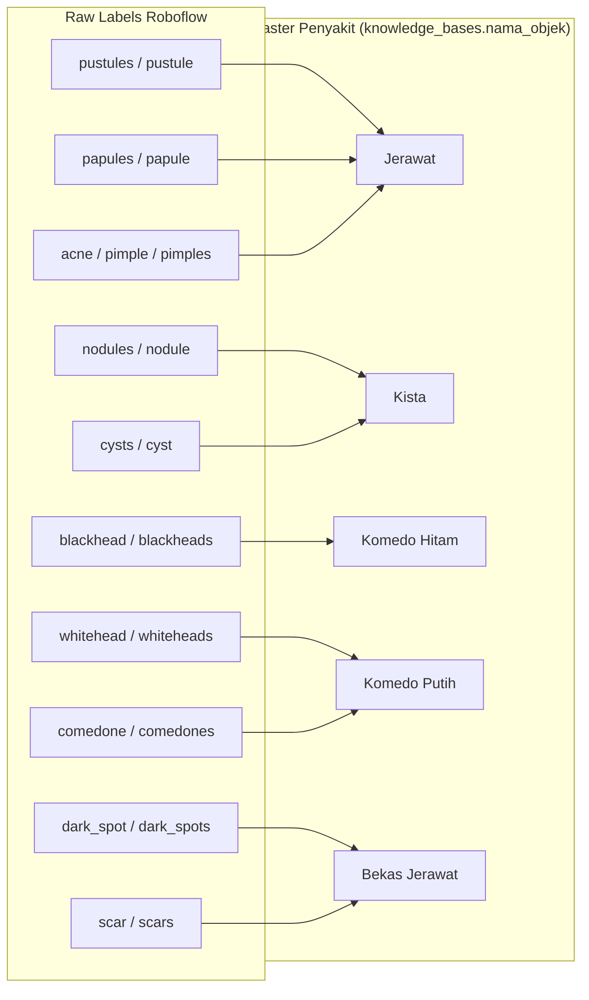
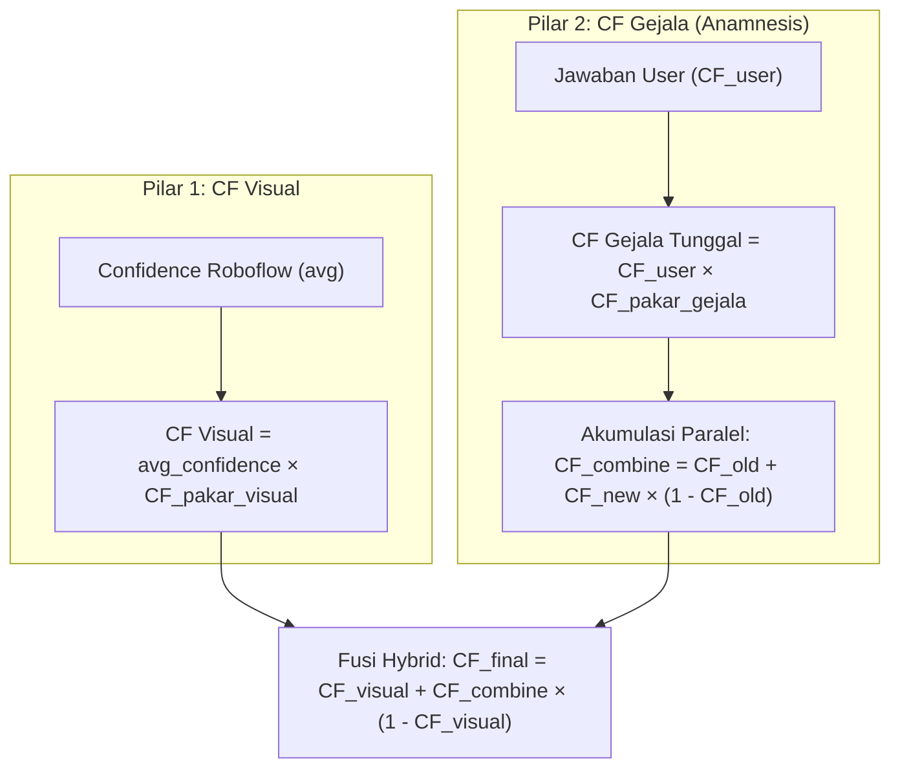
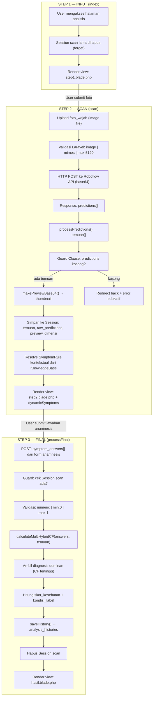
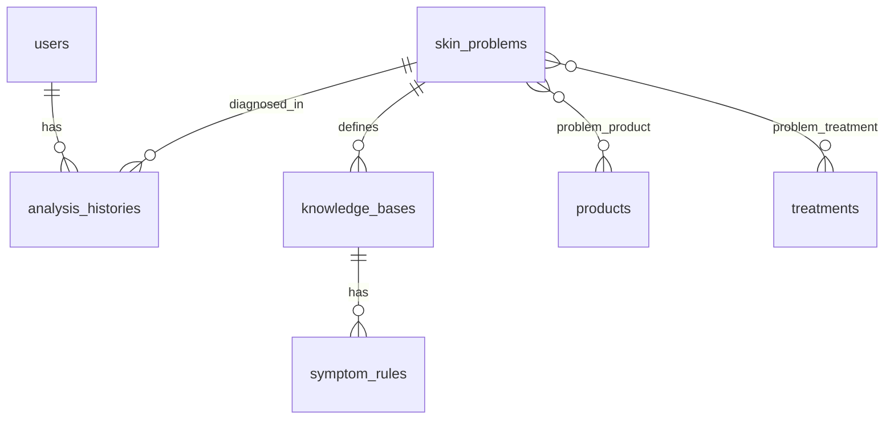

# 📋 Laporan Audit Kode & Analisis Arsitektur Sistem
## The Ethereal Clinic — Hybrid Certainty Factor Engine
**Tanggal Audit:** 17 Juni 2026  
**Auditor:** Antigravity AI (Senior Systems Analyst & IT Auditor)  
**File yang Diaudit:**
- [SkinAnalysisService.php](file:///c:/laragon/www/ethereal-clinic/app/Services/SkinAnalysisService.php)
- [AnalisisController.php](file:///c:/laragon/www/ethereal-clinic/app/Http/Controllers/AnalisisController.php)

---

## 1. ANALISIS KELAS OBJEK YANG DIOLAH SISTEM

### 1.1 Daftar Label Mentah Roboflow (Raw Labels) — `CLASS_MAP`

Definisi `CLASS_MAP` terletak di [SkinAnalysisService.php, baris 44–66](file:///c:/laragon/www/ethereal-clinic/app/Services/SkinAnalysisService.php#L44-L66). Array ini berfungsi sebagai **Translation Layer** antara label output model Roboflow (bahasa Inggris, varian singular/plural) dan nama objek klinis standar yang tersimpan di tabel `knowledge_bases`.

| # | Raw Label Roboflow | Klaster Penyakit Induk (DB) | Keterangan |
|---|---|---|---|
| 1 | `pustules` | **Jerawat** | Bentuk jamak (plural) |
| 2 | `pustule` | **Jerawat** | Bentuk tunggal (singular) |
| 3 | `papules` | **Jerawat** | Jerawat tipe papula (jamak) |
| 4 | `papule` | **Jerawat** | Jerawat tipe papula (tunggal) |
| 5 | `acne` | **Jerawat** | Label umum jerawat |
| 6 | `pimple` | **Jerawat** | Label informal (tunggal) |
| 7 | `pimples` | **Jerawat** | Label informal (jamak) |
| 8 | `nodules` | **Kista** | Nodul subkutan (jamak) |
| 9 | `nodule` | **Kista** | Nodul subkutan (tunggal) |
| 10 | `cysts` | **Kista** | Kista sejati (jamak) |
| 11 | `cyst` | **Kista** | Kista sejati (tunggal) |
| 12 | `blackhead` | **Komedo Hitam** | Komedo terbuka (tunggal) |
| 13 | `blackheads` | **Komedo Hitam** | Komedo terbuka (jamak) |
| 14 | `whitehead` | **Komedo Putih** | Komedo tertutup (tunggal) |
| 15 | `whiteheads` | **Komedo Putih** | Komedo tertutup (jamak) |
| 16 | `comedone` | **Komedo Putih** | Sinonim medis komedo (tunggal) |
| 17 | `comedones` | **Komedo Putih** | Sinonim medis komedo (jamak) |
| 18 | `dark_spot` | **Bekas Jerawat** | Hiperpigmentasi pasca-inflamasi (tunggal) |
| 19 | `dark_spots` | **Bekas Jerawat** | Hiperpigmentasi pasca-inflamasi (jamak) |
| 20 | `scar` | **Bekas Jerawat** | Bekas luka parut (tunggal) |
| 21 | `scars` | **Bekas Jerawat** | Bekas luka parut (jamak) |

**Total:** 21 raw label → 5 klaster penyakit induk

### 1.2 Diagram Klasterisasi



### 1.3 Mekanisme Pengelompokan (Mapping Flow)

Proses mapping terjadi di metode [processPredictions()](file:///c:/laragon/www/ethereal-clinic/app/Services/SkinAnalysisService.php#L447-L505):

1. Setiap prediksi Roboflow memiliki field `class` (e.g. `"Pustules"`)
2. Label di-lowercase-kan: `strtolower($pred['class'])`
3. Dicocokkan ke `CLASS_MAP`: `CLASS_MAP[$classRaw] ?? null`
4. Jika tidak ditemukan → di-log sebagai "Label tidak dikenal" dan **dilewati** (skip)
5. Jika ditemukan → dikelompokkan ke klaster penyakit induk, dihitung jumlah dan rata-rata confidence

> [!IMPORTANT]
> Label yang tidak terdaftar di `CLASS_MAP` akan **hilang tanpa peringatan ke user**. Hanya tercatat di log server. Lihat [Bagian 4: Deteksi Bug](#4-deteksi-potensi-bug-dan-vulnerabilitas-sistem) untuk analisis risiko terkait.

---

## 2. AUDIT MATEMATIKA & KALKULASI CERTAINTY FACTOR (CF) HYBRID

### 2.1 Ringkasan Hierarki Rumus

Sistem menggunakan **Certainty Factor (CF) Hybrid 2-Pilar** dengan arsitektur multi-diagnosis per klaster penyakit:



### 2.2 Step-by-Step Perhitungan Matematika

#### TAHAP 1 — CF Visual Tunggal per Klaster Penyakit

Dihitung di [processPredictions()](file:///c:/laragon/www/ethereal-clinic/app/Services/SkinAnalysisService.php#L470-L499) dan dikalibrasi ulang di [calculateMultiHybridCF() Tahap 4](file:///c:/laragon/www/ethereal-clinic/app/Services/SkinAnalysisService.php#L356-L387).

**Langkah 1a — Rata-rata Confidence Roboflow per Klaster:**

Untuk setiap klaster penyakit $P$, kumpulkan semua prediksi Roboflow yang ter-map ke klaster tersebut, lalu hitung rata-rata:

$$\bar{C}_P = \frac{1}{n_P} \sum_{i=1}^{n_P} c_i$$

Di mana:
- $\bar{C}_P$ = rata-rata confidence score untuk klaster penyakit $P$
- $n_P$ = jumlah objek terdeteksi dalam klaster $P$
- $c_i$ = confidence score prediksi ke-$i$ dari Roboflow (rentang 0.0 – 1.0)

**Langkah 1b — CF Visual Tunggal:**

$$CF_{visual}(P) = \bar{C}_P \times CF_{pakar\_visual}(P)$$

Di mana:
- $CF_{pakar\_visual}(P)$ = nilai `cf_pakar` dari tabel `knowledge_bases` yang cocok dengan `nama_objek = P` dan rentang `min_objek ≤ jumlah ≤ max_objek`
- Jika rule tidak ditemukan di DB, digunakan fallback $CF_{pakar\_visual} = 0.6$

> [!NOTE]
> **Contoh Numerik:** Jika Roboflow mendeteksi 3 pustules dengan confidence [0.85, 0.72, 0.91], maka:
> - $\bar{C}_{Jerawat} = (0.85 + 0.72 + 0.91) / 3 = 0.8267$
> - Jika `cf_pakar` di DB = 0.7, maka: $CF_{visual} = 0.8267 \times 0.7 = 0.5787$

---

#### TAHAP 2 — CF Gejala Tunggal (per Pertanyaan Anamnesis)

Dihitung di [calculateMultiHybridCF() Tahap 3](file:///c:/laragon/www/ethereal-clinic/app/Services/SkinAnalysisService.php#L321-L354).

Untuk setiap pertanyaan anamnesis $j$ yang dijawab oleh pasien:

$$CF_{gejala}(j) = CF_{user}(j) \times CF_{pakar\_gejala}(j)$$

Di mana:
- $CF_{user}(j)$ = nilai jawaban pasien dari slider form (rentang 0.0 – 1.0, di-clamp)
- $CF_{pakar\_gejala}(j)$ = nilai `cf_pakar` dari tabel `symptom_rules` untuk pertanyaan $j$

> [!NOTE]
> Nilai $CF_{user}$ di-clamp ke rentang [0.0, 1.0] menggunakan `min(1.0, max(0.0, ...))` untuk mencegah injeksi nilai negatif atau di atas 1 dari sisi klien.

---

#### TAHAP 3 — Akumulasi Kombinasi Gejala Paralel (Intra-Klaster)

Dihitung di [calculateMultiHybridCF() Tahap 5A](file:///c:/laragon/www/ethereal-clinic/app/Services/SkinAnalysisService.php#L389-L403).

Semua nilai $CF_{gejala}$ yang termasuk dalam klaster penyakit yang sama dikombinasikan secara berurutan menggunakan **Rumus Kombinasi CF Paralel Klasik**:

$$CF_{combine}^{(k)} = CF_{combine}^{(k-1)} + CF_{gejala}^{(k)} \times \left(1 - CF_{combine}^{(k-1)}\right)$$

Dengan nilai awal $CF_{combine}^{(0)} = 0.0$.

**Ekspansi untuk 3 gejala:**

$$CF_1' = CF_1$$

$$CF_2' = CF_1' + CF_2 \times (1 - CF_1')$$

$$CF_3' = CF_2' + CF_3 \times (1 - CF_2')$$

Di mana $CF_3'$ adalah $CF_{combine}$ akhir untuk klaster tersebut.

> [!NOTE]
> **Contoh Numerik:** Jika ada 3 gejala dalam klaster "Jerawat" dengan CF masing-masing [0.56, 0.42, 0.35]:
> - Iterasi 1: $CF_{combine} = 0 + 0.56 \times (1 - 0) = 0.56$
> - Iterasi 2: $CF_{combine} = 0.56 + 0.42 \times (1 - 0.56) = 0.56 + 0.1848 = 0.7448$
> - Iterasi 3: $CF_{combine} = 0.7448 + 0.35 \times (1 - 0.7448) = 0.7448 + 0.0893 = 0.8341$

---

#### TAHAP 4 — Fusi Hybrid Inter-Pilar (Visual + Gejala)

Dihitung di [calculateMultiHybridCF() Tahap 5B](file:///c:/laragon/www/ethereal-clinic/app/Services/SkinAnalysisService.php#L405-L409).

$$CF_{final}(P) = CF_{visual}(P) + CF_{combine}(P) \times \left(1 - CF_{visual}(P)\right)$$

Ini menggunakan rumus paralel yang sama, tetapi menggabungkan **antar-pilar** (visual dan gejala), bukan antar-gejala.

> [!NOTE]
> **Contoh Numerik (lanjutan):** Untuk klaster "Jerawat":
> - $CF_{visual} = 0.5787$, $CF_{combine} = 0.8341$
> - $CF_{final} = 0.5787 + 0.8341 \times (1 - 0.5787) = 0.5787 + 0.3513 = 0.9300$
> - Persentase: **93.0%**

---

#### TAHAP 5 — Konversi ke Skor Kesehatan & Label Kondisi

Dihitung di [AnalisisController@processFinal, baris 266–267](file:///c:/laragon/www/ethereal-clinic/app/Http/Controllers/AnalisisController.php#L266-L267).

$$Skor_{kesehatan} = \max\!\bigl(0,\;\text{round}(100 - CF_{final} \times 100)\bigr)$$

| Rentang Skor | Label Kondisi |
|---|---|
| 80 – 100 | Kulit Sehat |
| 60 – 79 | Kondisi Ringan |
| 40 – 59 | Kondisi Sedang |
| 20 – 39 | Kondisi Parah |
| 0 – 19 | Kondisi Sangat Parah |

> [!NOTE]
> Skor ini **berkorelasi terbalik** dengan CF: semakin tinggi CF_final (keyakinan penyakit), semakin rendah skor kesehatan.

### 2.3 Tabel Ringkasan Seluruh Rumus

| # | Nama Rumus | Formula | Lokasi Kode |
|---|---|---|---|
| 1 | Rata-rata Confidence | $\bar{C}_P = \frac{1}{n_P}\sum c_i$ | [processPredictions() L475-476](file:///c:/laragon/www/ethereal-clinic/app/Services/SkinAnalysisService.php#L475-L476) |
| 2 | CF Visual Tunggal | $CF_{visual} = \bar{C}_P \times CF_{pakar\_visual}$ | [calculateMultiHybridCF() L385](file:///c:/laragon/www/ethereal-clinic/app/Services/SkinAnalysisService.php#L385) |
| 3 | CF Gejala Tunggal | $CF_{gejala} = CF_{user} \times CF_{pakar\_gejala}$ | [calculateMultiHybridCF() L349](file:///c:/laragon/www/ethereal-clinic/app/Services/SkinAnalysisService.php#L349) |
| 4 | Kombinasi Paralel | $CF_{n} = CF_{n-1} + CF_{new} \times (1 - CF_{n-1})$ | [calculateMultiHybridCF() L400](file:///c:/laragon/www/ethereal-clinic/app/Services/SkinAnalysisService.php#L400) |
| 5 | Fusi Hybrid | $CF_{final} = CF_{visual} + CF_{combine} \times (1 - CF_{visual})$ | [calculateMultiHybridCF() L408](file:///c:/laragon/www/ethereal-clinic/app/Services/SkinAnalysisService.php#L408) |
| 6 | Skor Kesehatan | $Skor = \max(0, 100 - CF_{final} \times 100)$ | [processFinal() L266](file:///c:/laragon/www/ethereal-clinic/app/Http/Controllers/AnalisisController.php#L266) |

---

## 3. ANALISIS INPUT, PROSES, DAN OUTPUT (IPO MODEL) SISTEM

### 3.1 Diagram Alur Data End-to-End



### 3.2 Detail INPUT

| # | Sumber Data | Tipe | Deskripsi | Lokasi Kode |
|---|---|---|---|---|
| 1 | `Request::file('foto_wajah')` | `UploadedFile` | Foto selfie wajah user (JPG/PNG/WebP, max 5MB) | [scan() L97](file:///c:/laragon/www/ethereal-clinic/app/Http/Controllers/AnalisisController.php#L97) |
| 2 | `Request::input('symptom_answers')` | `array<id, float>` | Jawaban slider anamnesis (0.0–1.0 per pertanyaan) | [processFinal() L233](file:///c:/laragon/www/ethereal-clinic/app/Http/Controllers/AnalisisController.php#L233) |
| 3 | `Session::get('analisis_scan_result')` | `array` | Data temuan visual dari Step 2 (temuan, raw_predictions, preview, dimensi) | [processFinal() L218](file:///c:/laragon/www/ethereal-clinic/app/Http/Controllers/AnalisisController.php#L218) |
| 4 | `knowledge_bases` table | DB Records | Aturan CF pakar visual per objek penyakit (nama_objek, min/max_objek, cf_pakar) | [SkinAnalysisService L378-379](file:///c:/laragon/www/ethereal-clinic/app/Services/SkinAnalysisService.php#L378-L379) |
| 5 | `symptom_rules` table | DB Records | Pertanyaan anamnesis + CF pakar gejala per KnowledgeBase | [SkinAnalysisService L226-227](file:///c:/laragon/www/ethereal-clinic/app/Services/SkinAnalysisService.php#L226-L227) |
| 6 | Roboflow API Response | JSON | Array `predictions[]` berisi `class`, `confidence`, `x`, `y`, `width`, `height` | [analyzeVisual() L112](file:///c:/laragon/www/ethereal-clinic/app/Services/SkinAnalysisService.php#L112) |
| 7 | `Auth::id()` | `int` | ID user yang sedang login (untuk isolasi data) | Multiple locations |

### 3.3 Detail PROSES

| Tahap | Metode | Proses Yang Terjadi |
|---|---|---|
| **Validasi Foto** | `scan()` | Validasi Laravel: tipe gambar, ekstensi, ukuran ≤ 5MB |
| **Encoding** | `analyzeVisual()` | Baca file → encode ke base64 string |
| **API Call** | `analyzeVisual()` | HTTP POST ke Roboflow Inference API via Guzzle (timeout 30s) |
| **Parsing** | `processPredictions()` | Lowercase label → cari di CLASS_MAP → kelompokkan per klaster → hitung avg confidence |
| **Guard Clause** | `scan()` | Jika `roboflow_success = true` tapi `temuan = []` → tolak dengan pesan edukatif |
| **Thumbnail** | `makePreviewBase64()` | Resize gambar ke 480px max width via GD → encode JPEG base64 (quality 82) |
| **Session Store** | `scan()` | Simpan temuan, raw_predictions, preview, dimensi ke session |
| **Symptom Resolve** | `scan()` | Iterasi setiap temuan → cari KnowledgeBase matching → ambil `symptomRules` relasi |
| **Validasi Anamnesis** | `processFinal()` | Validasi: array, numeric, 0–1 per item |
| **CF Engine** | `calculateMultiHybridCF()` | Klasterisasi → CF visual × confidence → CF gejala × user → Paralel combine → Fusi hybrid |
| **Scoring** | `processFinal()` | Konversi CF final → skor kesehatan (inversi) → label teks |
| **Persistence** | `saveHistory()` | Simpan ke `analysis_histories` + resolve produk & treatment via `SkinProblem` |
| **Cleanup** | `processFinal()` | Hapus session scan setelah berhasil simpan |

### 3.4 Detail OUTPUT

#### A. Output ke View (`hasil.blade.php`)

```php
$hasil = [
    'cf_final'               => 0.9300,          // float — CF Hybrid akhir (0.0–1.0)
    'skor_kesehatan'         => 7,                // int — Skor inversi (0–100)
    'kondisi_label'          => 'Kondisi Sangat Parah',  // string — Label teks
    'temuan_klinis'          => [...],             // array — Detail temuan visual per klaster
    'roboflow_success'       => true,             // bool — Status API
    'error_message'          => null,             // string|null — Pesan error
    'total_objek_terdeteksi' => 15,               // int — Total bounding box
    'jenis_objek_unik'       => 3,                // int — Jumlah klaster unik
    'cf_breakdown'           => [                 // array — Audit trail CF dominan
        'cf_visual'  => 0.5787,
        'cf_gejala'  => 0.8341,
    ],
    'multi_diagnosis'        => [...],            // array — Seluruh klaster + CF
    'raw_predictions'        => [...],            // array — Koordinat bbox Roboflow
    'img_width'              => 1280,             // int|null — Dimensi gambar asli
    'img_height'             => 720,              // int|null — Dimensi gambar asli
    'preview_base64'         => 'data:image/jpeg;base64,...', // string|null — Thumbnail
];
```

#### B. Output ke Database (`analysis_histories`)

| Kolom | Tipe | Nilai |
|---|---|---|
| `user_id` | int | ID user yang melakukan analisis |
| `result_problem_id` | int | FK ke `skin_problems.id` (penyakit dominan) |
| `confidence_score` | float | $CF_{final} \times 100$ (persentase, e.g. 93.00) |
| `analysis_data` | JSON | Seluruh data temuan, breakdown, raw predictions, jawaban anamnesis |
| `recommended_products` | JSON | Array produk yang direkomendasikan (dari relasi `SkinProblem->products`) |
| `recommended_treatments` | JSON | Array tindakan klinik yang direkomendasikan |
| `recommended_ingredients` | JSON | Array kosong `[]` (belum diimplementasi) |
| `notes` | text | Catatan ringkasan mesin CF (format sprintf) |

---

## 4. DETEKSI POTENSI BUG DAN VULNERABILITAS SISTEM

### 4.1 Temuan Kritis (High Severity)

#### 🔴 BUG-01: Fallback `result_problem_id` Tidak Deterministik

**Lokasi:** [saveHistory() L556](file:///c:/laragon/www/ethereal-clinic/app/Http/Controllers/AnalisisController.php#L556)

```php
'result_problem_id' => $resultProblemId ?? (SkinProblemModel::first()?->id ?? 1),
```

**Masalah:** Jika `$resultProblemId` null (tidak ditemukan KnowledgeBase matching), sistem menggunakan `SkinProblemModel::first()` yang mengembalikan **record pertama secara acak** (tergantung urutan insert DB). Jika tabel kosong, hardcode `1` akan menyebabkan **foreign key constraint violation** karena ID 1 belum tentu ada.

**Dampak:** Rekam medis bisa dikaitkan dengan penyakit yang salah, atau crash jika DB kosong.

**Saran Perbaikan:**
```php
// Gunakan nullable FK, atau buat seeder penyakit default
'result_problem_id' => $resultProblemId, // Biarkan null jika tidak ditemukan
```

---

#### 🔴 BUG-02: `exportPdf()` Tidak Memiliki Guard Clause untuk `null` History

**Lokasi:** [exportPdf() L347-353](file:///c:/laragon/www/ethereal-clinic/app/Http/Controllers/AnalisisController.php#L347-L353)

```php
$history = AnalysisHistoryModel::with(...)
    ->where('id', $id)
    ->where('user_id', Auth::id())
    ->latest()
    ->first(); // Bisa return null!

$skor = (int) round(100 - $history->confidence_score); // ← NULL POINTER!
```

**Masalah:** Menggunakan `->first()` tanpa `->firstOrFail()`, sehingga jika record tidak ditemukan (ID tidak valid atau bukan milik user), `$history` bernilai `null` dan baris berikutnya akan crash: `Trying to access property on null`.

**Dampak:** HTTP 500 Internal Server Error tanpa pesan yang informatif.

**Saran Perbaikan:**
```php
$history = AnalysisHistoryModel::with(['skinProblem', 'user'])
    ->where('id', $id)
    ->where('user_id', Auth::id())
    ->firstOrFail(); // Otomatis return 404 jika tidak ditemukan
```

---

#### 🔴 BUG-03: Potensi `preview_base64` Null pada View Riwayat

**Lokasi:** [show() L399-414](file:///c:/laragon/www/ethereal-clinic/app/Http/Controllers/AnalisisController.php#L399-L414)

**Masalah:** Metode `show()` merekonstruksi `$hasil` dari `analysis_data` JSON, tetapi **tidak menyertakan `preview_base64`**. Field ini disimpan di session (bukan di `analysis_data` JSON), sehingga saat membuka riwayat, foto preview wajah tidak tersedia.

**Dampak:** Halaman riwayat mungkin menampilkan area kosong di tempat foto wajah seharusnya muncul.

**Saran Perbaikan:** Simpan `preview_base64` ke dalam kolom tersendiri di `analysis_histories` (atau ke storage file) saat `saveHistory()`, lalu restore di `show()`.

---

### 4.2 Temuan Sedang (Medium Severity)

#### 🟡 BUG-04: Duplikasi Query KnowledgeBase di `scan()` dan `processFinal()`

**Lokasi:**
- [scan() L150-156](file:///c:/laragon/www/ethereal-clinic/app/Http/Controllers/AnalisisController.php#L150-L156) — Query KnowledgeBase untuk resolve SymptomRule
- [saveHistory() L502-509](file:///c:/laragon/www/ethereal-clinic/app/Http/Controllers/AnalisisController.php#L502-L509) — Query KnowledgeBase yang **identik** untuk resolve produk

**Masalah:** Query yang sama (`KnowledgeBase::where('nama_objek', ...)->where('min_objek', ...)`) dieksekusi dua kali di tahap berbeda. Ini bukan N+1 klasik, tapi **duplikasi logis** yang menambah beban DB.

**Saran Perbaikan:** Cache hasil query KnowledgeBase di session atau teruskan via parameter.

---

#### 🟡 BUG-05: Lazy Loading `symptomRules` di Loop `scan()`

**Lokasi:** [scan() L160](file:///c:/laragon/www/ethereal-clinic/app/Http/Controllers/AnalisisController.php#L160)

```php
$dynamicSymptoms = $dynamicSymptoms->merge($knowledgeBase->symptomRules);
```

**Masalah:** `$knowledgeBase` diambil dengan `->first()` tanpa eager loading `symptomRules`. Jika ada 5 klaster temuan, ini menghasilkan **5 query tambahan** (N+1 pattern). Tiap klaster penyakit memicu query `SELECT * FROM symptom_rules WHERE knowledge_base_id = ?`.

**Saran Perbaikan:**
```php
$knowledgeBase = KnowledgeBase::with('symptomRules') // Eager load
    ->where('nama_objek', $temuan['nama_objek'])
    ->where(...)
    ->first();
```

---

#### 🟡 BUG-06: `calculateSymptomCF()` Adalah Dead Code

**Lokasi:** [calculateSymptomCF() L209-254](file:///c:/laragon/www/ethereal-clinic/app/Services/SkinAnalysisService.php#L209-L254)

**Masalah:** Metode `calculateSymptomCF()` tidak pernah dipanggil di mana pun. Controller langsung memanggil `calculateMultiHybridCF()` yang memiliki logika CF gejala sendiri secara inline. Metode ini adalah **dead code** sisa refactoring.

**Dampak:** Tidak ada dampak fungsional, tetapi menambah beban kognitif saat maintenance.

**Saran Perbaikan:** Hapus metode ini, atau refaktor `calculateMultiHybridCF()` agar mendelegasikan perhitungan CF gejala ke `calculateSymptomCF()` supaya DRY.

---

#### 🟡 BUG-07: `calculateFinalCF()` Adalah Dead Code

**Lokasi:** [calculateFinalCF() L170-187](file:///c:/laragon/www/ethereal-clinic/app/Services/SkinAnalysisService.php#L170-L187)

**Masalah:** Sama seperti BUG-06, metode ini tidak dipanggil oleh controller manapun. Logika kombinasi paralel sudah di-inline di dalam `calculateMultiHybridCF()`.

---

#### 🟡 BUG-08: Asimetri Penamaan FK pada Pivot Table

**Lokasi:** Model `SkinProblemModel` — relasi `products()` dan `treatments()`

**Masalah:** Dua tabel pivot yang berhubungan dengan `skin_problems` menggunakan penamaan FK yang **tidak konsisten**:

| Pivot Table | FK ke `skin_problems` | FK ke Entitas |
|---|---|---|
| `problem_product` | `skin_problem_id` | `product_id` |
| `problem_treatment` | `problem_id` | `treatment_id` |

Selain itu, `problem_product` adalah pure composite-PK pivot (tanpa `id`, tanpa timestamps), sementara `problem_treatment` memiliki kolom `id` autoincrement dan timestamps. Inkonsistensi ini meningkatkan risiko kesalahan query manual dan menyulitkan maintenance.

**Dampak:** Tidak berdampak fungsional saat ini (karena Laravel model sudah mendefinisikan FK secara eksplisit), tetapi membingungkan saat debugging raw SQL atau migrasi di masa depan.

**Saran Perbaikan:** Standarisasi penamaan FK: gunakan `skin_problem_id` di kedua tabel pivot, dan seragamkan struktur pivot (dengan atau tanpa `id` & timestamps).

---

### 4.3 Temuan Ringan (Low Severity)

#### 🟢 BUG-09: Label Roboflow Baru Tidak Akan Terdeteksi (Silent Drop)

**Lokasi:** [processPredictions() L456-460](file:///c:/laragon/www/ethereal-clinic/app/Services/SkinAnalysisService.php#L456-L460)

**Masalah:** Jika model Roboflow di-retrain dan menghasilkan label baru (e.g. `"rosacea"`, `"melasma"`), label tersebut akan di-skip tanpa notifikasi ke user. Hanya tercatat di log server (`Log::debug`).

**Dampak:** User mungkin mendapatkan hasil analisis yang tidak lengkap tanpa menyadarinya.

**Saran Perbaikan:** Tambahkan mekanisme alerting (e.g. kirim notifikasi ke admin jika ditemukan label tidak dikenal yang frekuensinya tinggi).

---

#### 🟢 BUG-10: Guzzle Client Di-instantiate di Constructor (Tidak Mockable)

**Lokasi:** [constructor L77-81](file:///c:/laragon/www/ethereal-clinic/app/Services/SkinAnalysisService.php#L77-L81)

**Masalah:** `new Client(...)` di-hardcode di constructor, membuat kelas ini sulit di-unit test (tidak bisa mock HTTP client).

**Saran Perbaikan:** Inject `Client` via constructor parameter atau gunakan Laravel HTTP facade.

---

#### 🟢 BUG-11: Config Fallback ke `env()` Langsung

**Lokasi:** [constructor L74-75](file:///c:/laragon/www/ethereal-clinic/app/Services/SkinAnalysisService.php#L74-L75)

```php
$this->apiKey  = config('services.roboflow.api_key',  env('ROBOFLOW_API_KEY'));
$this->modelId = config('services.roboflow.model_id', env('ROBOFLOW_MODEL_ID'));
```

**Masalah:** Pemanggilan `env()` langsung di luar file config melanggar best practice Laravel. Setelah `php artisan config:cache`, panggilan `env()` akan return `null` karena file `.env` tidak lagi dibaca.

**Saran Perbaikan:** Definisikan semua config di `config/services.php` dan hanya gunakan `config()`:
```php
// config/services.php
'roboflow' => [
    'api_key'  => env('ROBOFLOW_API_KEY'),
    'model_id' => env('ROBOFLOW_MODEL_ID'),
],

// Service
$this->apiKey  = config('services.roboflow.api_key');
```

---

#### 🟢 BUG-12: DomPDF dengan `isRemoteEnabled = false`

**Lokasi:** [exportPdf() L370](file:///c:/laragon/www/ethereal-clinic/app/Http/Controllers/AnalisisController.php#L370)

**Masalah:** `isRemoteEnabled` di-set ke `false`, artinya DomPDF **tidak bisa** memuat gambar dari URL eksternal (termasuk base64 yang panjang di beberapa kasus). Jika template PDF menggunakan `` yang sangat panjang, DomPDF mungkin gagal render atau timeout.

**Saran Perbaikan:** Jika perlu menyertakan foto wajah di PDF, simpan gambar ke storage lokal dan gunakan path absolut.

---

#### 🟢 BUG-13: Precision Loss pada Konversi Skor Bolak-Balik

**Lokasi:**
- [processFinal() L266](file:///c:/laragon/www/ethereal-clinic/app/Http/Controllers/AnalisisController.php#L266): `$skorKesehatan = max(0, round(100 - ($cfFinal * 100)))`
- [saveHistory() L557](file:///c:/laragon/www/ethereal-clinic/app/Http/Controllers/AnalisisController.php#L557): `'confidence_score' => round($hasil['cf_final'] * 100, 2)`
- [show() L400](file:///c:/laragon/www/ethereal-clinic/app/Http/Controllers/AnalisisController.php#L400): `'cf_final' => round($history->confidence_score / 100, 4)`

**Masalah:** CF final disimpan sebagai persentase (`* 100`), lalu dikonversi balik (`/ 100`) saat dibaca. Ini menyebabkan **precision loss** karena rounding berganda. Contoh: `0.9341 * 100 = 93.41 → round(, 2) = 93.41 → / 100 = 0.9341` (aman dalam kasus ini, tapi secara umum rawan).

**Saran Perbaikan:** Simpan CF sebagai nilai mentah (0.0–1.0) di DB dan lakukan konversi ke persentase hanya di layer presentasi.

---

### 4.4 Ringkasan Temuan

| Severity | ID | Ringkasan | Impact |
|---|---|---|---|
| 🔴 High | BUG-01 | Fallback `result_problem_id` non-deterministik | Data rekam medis salah / FK violation |
| 🔴 High | BUG-02 | `exportPdf()` crash jika history null | HTTP 500 |
| 🔴 High | BUG-03 | `preview_base64` tidak tersimpan ke DB | Foto hilang di riwayat |
| 🟡 Medium | BUG-04 | Duplikasi query KnowledgeBase | Beban DB berlebih |
| 🟡 Medium | BUG-05 | N+1 query pada `symptomRules` di `scan()` | Performa degradasi |
| 🟡 Medium | BUG-06 | `calculateSymptomCF()` dead code | Beban maintenance |
| 🟡 Medium | BUG-07 | `calculateFinalCF()` dead code | Beban maintenance |
| 🟡 Medium | BUG-08 | Asimetri FK naming pada pivot tables | Risiko maintenance |
| 🟢 Low | BUG-09 | Silent drop label Roboflow baru | Hasil tidak lengkap |
| 🟢 Low | BUG-10 | Guzzle Client tidak mockable | Tidak bisa unit test |
| 🟢 Low | BUG-11 | `env()` langsung di luar config | Crash setelah config:cache |
| 🟢 Low | BUG-12 | DomPDF `isRemoteEnabled = false` | Gambar gagal render di PDF |
| 🟢 Low | BUG-13 | Precision loss pada konversi CF ↔ persentase | Akurasi numerik turun |

---

> [!TIP]
> **Prioritas perbaikan yang disarankan:**
> 1. **Segera** — Fix BUG-02 (`firstOrFail` di `exportPdf`) karena bisa menyebabkan crash produksi
> 2. **Segera** — Fix BUG-01 (nullable FK atau seeder default)
> 3. **Sprint berikutnya** — Fix BUG-05 (eager loading) dan BUG-11 (`env()` fallback)
> 4. **Backlog** — Bersihkan dead code (BUG-06, BUG-07) dan evaluasi strategi penyimpanan gambar (BUG-03)

---

## LAMPIRAN: Skema Database Sistem

Berikut adalah skema final dari seluruh tabel yang terlibat dalam pipeline analisis, berdasarkan file migrasi Laravel yang telah diaudit.

### Tabel `knowledge_bases`

| Kolom | Tipe | Catatan |
|---|---|---|
| `id` | bigIncrements | PK |
| `skin_problem_id` | unsignedBigInteger | nullable, FK → `skin_problems.id` (onDelete: set null) |
| `nama_objek` | string(100) | Nama klaster penyakit (e.g. "Jerawat") |
| `tingkat_keparahan` | enum('Ringan','Sedang','Parah') | |
| `min_objek` | unsignedSmallInteger | Batas bawah rentang jumlah objek |
| `max_objek` | unsignedSmallInteger | nullable — null berarti "tak terbatas" |
| `cf_pakar` | double(4,2) | Nilai keyakinan pakar (0.0–1.0) |
| `timestamps` | | |

### Tabel `symptom_rules`

| Kolom | Tipe | Catatan |
|---|---|---|
| `id` | bigIncrements | PK |
| `knowledge_base_id` | unsignedBigInteger | FK → `knowledge_bases.id` (onDelete: cascade) |
| `pertanyaan` | string | Teks pertanyaan anamnesis |
| `cf_pakar` | double | Awalnya bernama `cf_gejala`, direname via migrasi `2026_06_08` |
| `timestamps` | | |

### Tabel `analysis_histories`

| Kolom | Tipe | Catatan |
|---|---|---|
| `id` | bigIncrements | PK |
| `user_id` | unsignedBigInteger | FK → `users.id` (onDelete: cascade) |
| `analysis_data` | json | Seluruh data temuan, breakdown CF, raw predictions |
| `result_problem_id` | unsignedBigInteger | FK → `skin_problems.id` (onDelete: cascade) |
| `confidence_score` | decimal(5) | CF final × 100 (persentase) |
| `recommended_ingredients` | json | |
| `recommended_products` | json | |
| `recommended_treatments` | json | nullable |
| `notes` | text | nullable |
| `timestamps` | | |

### Tabel `skin_problems`

| Kolom | Tipe | Catatan |
|---|---|---|
| `id` | bigIncrements | PK |
| `name` | string | Nama penyakit kulit |
| `description` | text | Deskripsi penyakit |
| `severity_level` | string | Level keparahan |
| `timestamps` | | |

### Tabel `products`

| Kolom | Tipe | Catatan |
|---|---|---|
| `id` | bigIncrements | PK |
| `name` | string | Nama produk |
| `brand` | string | Merek |
| `category` | string | Kategori |
| `description` | text | Deskripsi / kandungan |
| `how_to_use` | text | nullable |
| `image_path` | string | nullable |
| `timestamps` | | |

### Tabel `treatments`

| Kolom | Tipe | Catatan |
|---|---|---|
| `id` | bigIncrements | PK |
| `name` | string | Nama tindakan klinik |
| `description` | text | Deskripsi |
| `priority` | integer | default 0 — masih ada di DB meski migration filename menyebut "drop" |
| `timestamps` | | |

### Tabel Pivot `problem_product`

| Kolom | Tipe | Catatan |
|---|---|---|
| `skin_problem_id` | unsignedBigInteger | FK → `skin_problems.id` (cascade), composite PK |
| `product_id` | unsignedBigInteger | FK → `products.id` (cascade), composite PK |

### Tabel Pivot `problem_treatment`

| Kolom | Tipe | Catatan |
|---|---|---|
| `id` | bigIncrements | PK (non-composite) |
| `problem_id` | unsignedBigInteger | FK → `skin_problems.id` (cascade) — **⚠️ inkonsisten dengan `skin_problem_id` di pivot lain** |
| `treatment_id` | unsignedBigInteger | FK → `treatments.id` (cascade) |
| `timestamps` | | |

### Diagram Relasi Antar-Tabel



---

*Laporan ini dihasilkan berdasarkan analisis statis kode sumber. Pengujian dinamis (runtime) disarankan untuk memvalidasi temuan-temuan di atas.*
